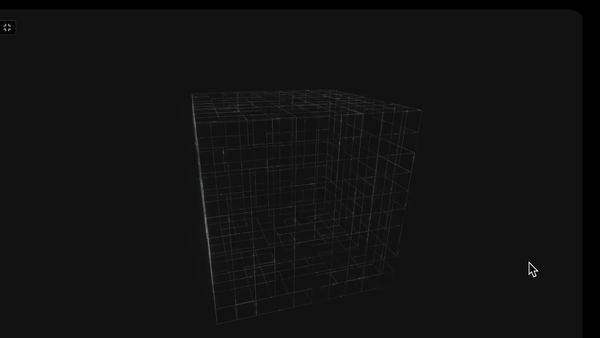

<div align="center">
  <a name="readme-top"></a>
  
  <h1 align="center">SIGNAL MESH</h1>
  <h3 align="center"> Procedural WebGL Light Flow Grid Engine </h3>
</div>

<div align="center">
  <!-- TOP PURPLE LINKS -->
  <a href="https://beto.group"></a>
  <a href="https://discord.com/invite/6rDp4q4Y2B"></a>
  <a href="https://github.com/sponsors/beto-group"></a>
  <br/>
  <!-- BOTTOM GOLD TAXONOMY -->
  
  
  
  <hr>
</div>

<div align="center">
  
</div>

<div align="center">
  <p>
    <i> A Three.js WebGL procedural line segments grid visualizer — displaying moving light signals flowing through network nodes inside customizable 3D forms with real-time controls. </i>
  </p>
  <hr style="width:30%;">
</div>

Welcome to **Signal Mesh**, a stunning WebGL particle network visualizer designed for Obsidian using Datacore. It generates a procedural, self-connecting line segments topology within distinct 3D geometry form factors, mapping glowing signals that travel continuously along the wireframe paths using custom GLSL shaders and real-time bloom post-processing — all cached locally so it works offline after first load.

---

## Features

### 3D Network Topology
*   **Procedural Grid Generation**: Generates line segments structures procedurally inside multiple customizable form factors (Hexagon, Sphere, Pyramid, Torus, Cube).
*   **Surface Constraint Toggle**: Toggle between filling the entire volume or constraining the node paths strictly to the geometry's outer surfaces.

### Custom GLSL Shaders
*   **Flow Signal Simulation**: Custom GLSL vertex and fragment shaders animate moving glowing signals flowing along the wireframe paths.
*   **Signal Customization**: Real-time control over Flow Speed, Signal Tail length, and Density.

### Immersive Post-Processing & Rendering
*   **Epic UnrealBloom Overlay**: Add and adjust a high-quality post-processing bloom overlay in real-time.
*   **Dynamic Depth Fog**: Toggle and density-adjust Exp2 fog elements to create depth-of-field styling.

### Fully Adaptive Theme Support
*   **Obsidian Theme Native**: Color overrides automatically scan your active host theme to match Background and Accent flow colors.
*   **Themed Control Panel**: Standard `lil-gui` panel controls beautifully styled matching Obsidian's dark look.

---

## Directory Index & Components

| File | Description |
| :--- | :--- |
| **[`SIGNAL MESH.md`](SIGNAL%20MESH.md)** | The main entry point leaf designed to be loaded inside Obsidian panes. |
| **[`src/index.jsx`](src/index.jsx)** | Main bootstrap application loader and polling invalidation daemon. |
| **[`src/App.jsx`](src/App.jsx)** | The view coordinator loading dependency modules. |
| **[`src/components/SignalComponent.jsx`](src/components/SignalComponent.jsx)** | The core rendering component with Three.js engine and custom GLSL shaders. |
| **[`src/styles/styles.jsx`](src/styles/styles.jsx)** | Layout variables mapped to Obsidian theme CSS properties. |
| **[`src/utils/domUtils.jsx`](src/utils/domUtils.jsx)** | DOM helper utilities for full-tab containment. |
| **[`src/utils/LoadScriptUpgrade.js`](src/utils/LoadScriptUpgrade.js)** | Self-contained ESM script loader with local vault cache support. |
| **[`data/mcp_commands.json`](data/mcp_commands.json)** | Local polling payload for HMR invalidation. |
| **[`METADATA.md`](METADATA.md)** | Packaging manifest outlining indexing, target, and security configurations. |
| **[`CONTRIBUTION.md`](CONTRIBUTION.md)** | Contributor architecture standards. |
| **[`LICENSE.md`](LICENSE.md)** | MIT open-source license. |

---

## 🚀 Quick Start & Installation

1. **Get the Code**:
   *   **Option A**: Clone directly into your Obsidian vault directory:
       ```shell
       git clone https://github.com/beto-group/SignalMesh
       ```
   *   **Option B**: Extract the repository ZIP into your Obsidian vault.
2. **Prerequisites**: Ensure the **Datacore** community plugin is active in Obsidian.
3. **Launch**: Open **`SIGNAL MESH.md`** inside Obsidian.

---

## ⚖️ License

This project is licensed under the MIT License — see the [`LICENSE.md`](LICENSE.md) file for details.

<p align="right">(<a href="#readme-top">back to top</a>)</p>
